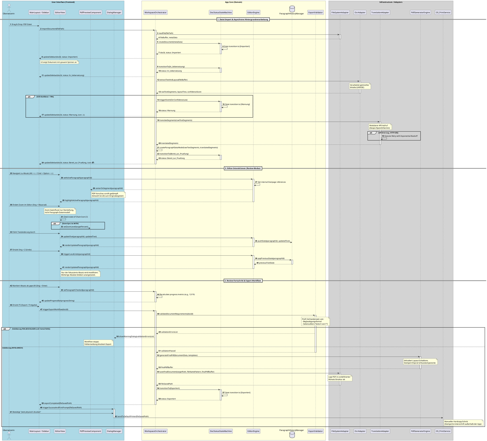

# PlantUML-Sequenzdiagramm – Kern-Workflow (Version 1.1)

## 1. Verhaltensspezifikation und Interaktionsströme

Das folgende Sequenzdiagramm beschreibt die dynamischen Abläufe der Übersetzungs-App. Es visualisiert die sequenzielle Abfolge von Funktionsaufrufen und Events zwischen den Systemkomponenten (Frontend, Core-Domäne und Infrastruktur-Adapter) entlang des gesamten Dokumenten-Lebenszyklus.

### Kernmerkmale der Modellierung:
- **Asynchrone Entkopplung:** Hintergrundprozesse (OCR-Verarbeitung und API-Anfragen) laufen vollständig blockierungsfrei ab, sodass die Benutzeroberfläche jederzeit reaktiv bleibt.
- **Zustandssicherheit (State Machine):** Statusübergänge werden strikt deterministisch über den `DocStatusStateMachine`-Teilnehmer geschaltet.
- **Isolierter Kontext:** Editor-Interaktionen (wie die Undo/Redo-Historie) sind granular an die jeweilige `paragraphId` gebunden, um unerwünschte Nebeneffekte auf globaler Ebene zu verhindern.
- **Harte Validierung:** Der Export-Prozess erzwingt eine formale Prüfung (Beglaubigungsformel, rechtliche Schablone) im Core, bevor die PDF-Generierung initiiert wird.

---

## 2. PlantUML-Spezifikationscode

---

## 3. Architektur-Konformität

Dieses Verhaltensmodell korrespondiert vollständig mit den strukturellen Festlegungen der vorhergehenden Entwicklungsphasen:

1. **Ports & Adapters:** Komponenten der rechten Box (Infrastruktur) agieren strikt gekapselt hinter ihren definierten Systemschnittstellen (`ITranslationService`, `IOcrService`, `IPdfGenerator`, `IFileSystem`). Eine Auswechslung der konkreten Adapter-Implementierungen hat keinerlei Auswirkungen auf den Kontrollfluss des Kerns.
2. **Datenmodell-Konsistenz:** Der hierarchische Aufbau von `Document` zu segmentierten Einheiten mit fester `Paragraph_ID` ist die informationstechnische Bedingung für den synchronisierten Fokus- und Render-Mechanismus.

